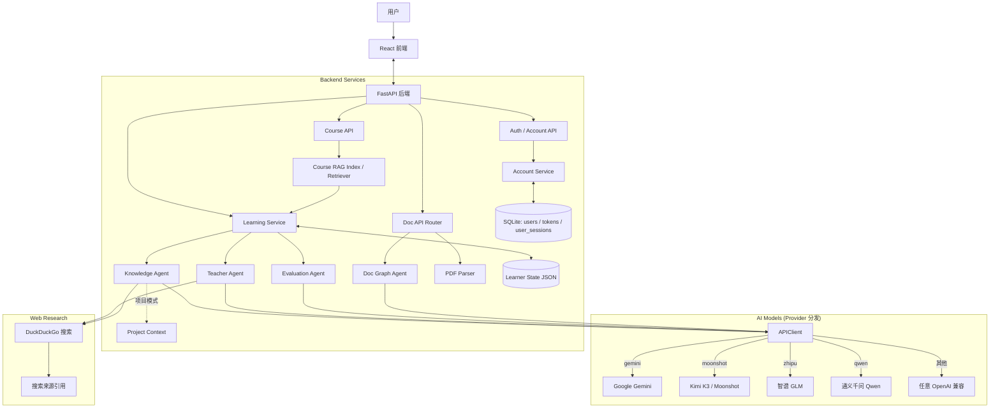

<p align="center">
  
  
  
  
  
  
  
  
  
</p>

<h1 align="center">🌟 AstraMentor</h1>

<p align="center">
  <strong>通过 AI 驱动的交互式知识星图，重新定义你的学习方式。</strong>
</p>

  AstraMentor 是一个基于多 Agent 架构的全栈 AI 教学系统。它不只是一个聊天机器人，而是一位能够感知你需要学什么、该怎么学、并实时跟踪你学习状态的智能私教。支持<strong>课程知识库模式</strong>（职业教育教材优先、回答可追溯）、<strong>主题模式</strong>（输入任意主题自由学习）、<strong>文档模式</strong>（上传 PDF 文件精读论文/教材）和<strong>项目模式</strong>（输入项目需求，AI 为你生成完成该项目所需的技能路径）。

<br/>

## ✨ 核心特性 (Key Features)

### 🌌 动态知识星图 (Knowledge Graph)

拒绝线性死板的教程。系统根据你的学习目标，实时生成可视化的**知识依赖图谱**。

- **性能优化**: 采用 AntV G6 高性能渲染引擎，流畅支持海量节点展示
- **3D星空图谱**: 一键切换 3D 力导向图谱视图，在立体的星空背景中探索知识
- **智能交互**: 点击节点高亮关联路径，清晰展示知识脉络，支持灵活的鼠标拖拽与漫游
- **视觉升级**: 动态发光效果、平滑曲线连接，配合实时掌握度（彩色填充）状态展示
- **图谱扩展**: 支持用户**手动添加节点**，AI 智能分析现有图谱，自动生成适当的中间过渡节点并建立自然递进的层次连接
- **复杂度控制**: 生成星图时可通过分段滑块选择**3 档知识深度**（简洁 4~7 节点 / 标准 8~12 节点 / 详细 13~20 节点），按需定制图谱规模
- **多语言适配**: 界面元素全方位支持中英文双语切换，满足不同语言习惯
- **灵活布局**: 2D 模式下支持纵向/横向布局一键切换，支持自适应视口居中定位

### 💬 自适应多模态教学 (Adaptive AI Teaching)

- **5 档自适应教学**: AI 根据你的掌握度（0%~100%）自动调整 4 个维度——讲解深度、代码要求、表达方式、术语使用，从通俗类比到源码级剖析无缝过渡
- **计划驱动教学**: 每个知识点会先生成 3-6 步教学计划，按步骤递进学习，确保知识点覆盖完整
- **多模态支持**: 支持**图片上传**。遇到看不懂的代码或数学公式？截图发给 AI，它能精准识别并解析
- **在线 IDE**: 内置**代码编辑器**，支持 Python, JavaScript, Go, C, C++, Java 六种语言，直接在浏览器中编写并运行代码

### 🔄 步骤化教学闭环 (Step-by-Step Loop)

独创的 **Plan → Teach → Quiz → Evaluate → Next** 闭环：

1.  **生成计划**: AI 根据知识点和前驱依赖，生成 3-6 步递进教学计划
2.  **逐步讲解**: 每步只讲当前步骤内容，不超前不遗漏
3.  **步骤测验**: 每步讲完后由独立的评估 Agent 出题验证
4.  **双层评分**: 步骤分独立记录，全局掌握度通过加权聚合计算（后面步骤权重更大）
5.  **针对性重讲**: 答错可基于错误分析精准重讲，通过后进入下一步

### 📊 智能学习画像 (Learner Profile)

- **实时仪表板**: 左侧 Dashboard 实时显示你的学习进度曲线（支持折叠收起）
- **双层评分算法**: 每步测验分独立记录（`step_scores`），全局掌握度 = 加权平均 × 完成度系数 × 目标掌握度，杜绝"还没学完就高分"
- **5 档反馈体系**: 🌱 还需努力 → 💡 有所领悟 → 📖 基本掌握 → 💪 表现不错 → 🌟 非常出色
- **持久化**: 你的每一次对话、每一个知识点的状态、教学计划和步骤分数都会被保存
- **主页历史学习**: 最近星图显示在主页右侧，可恢复到上次节点、步骤、聊天与未完成测验

### ⚡ 流式回答与生成控制

- **边生成边阅读**: 自由问答、开始讲课、下一步和重新讲解均通过 SSE 流式显示
- **回答长度**: 自由问答可选 1024 / 2048 / 4096 / 8192 或 256~32768 自定义 Max Tokens
- **Thinking 模式**: 支持的模型会把思考内容放在可折叠区域；不支持时自动降级并显示提醒
- **测验强绑定**: 题目绑定教学计划版本、当前步骤和最近完整讲解，旧题或串步骤题会被拒绝

### 🛡️ 沉浸体验与护眼 (Focus & Eye Care)

- **复古像素白昼**: 白天模式创新融合了经典复古像素艺术（Pixel Art）风格、粗黑框元素与像素字体，带来别致操作体验
- **暖色护眼阅读**: 一键切换米黄色暖调护眼主题（Eye-Care），适配沉浸式长篇教学阅读，减轻视觉疲劳
- **可调节布局**: 面板宽度随意拖拽，配合柔和的响应式动态组件

### 🔍 联网搜索增强 (Web Research)

- **实时搜索**: 教学和讨论环节自动通过 DuckDuckGo 搜索引擎获取最新资料
- **搜索来源展示**: AI 回复下方展示可点击的搜索来源卡片，方便追溯原文
- **星图智能预研**: 生成知识图谱和扩展节点时先搜索最新知识结构，让图谱更准确
- **零配置**: 默认启用，可通过 `.env` 中 `ASTRA_WEB_SEARCH_ENABLED=false` 关闭
- **容错回退**: 搜索失败时自动回退到无搜索模式，不影响正常功能

### 🧠 多 Agent 协同架构

- **Knowledge Agent**: 负责构建知识图谱结构，支持 3 档复杂度动态提示词
- **Doc Graph Agent**: 负责基于文档内容构建文档专属星图 [NEW]
- **Teacher Agent**: 负责按教学计划逐步输出教学内容（禁止出题）
- **Evaluation Agent**: 独立于教学 Agent，负责出题、评分与错误分析
- **Code Runner**: 负责在后端安全沙箱中执行用户代码

### 📄 文档模式 (Document Mode)

上传 PDF 文件（论文、教材、技术文档），AI **严格围绕文档原文**帮你读懂每一页。

- **PDF 智能解析**: PyMuPDF 提取文本，按段落/章节自动分块，保留页码和标题
- **文档专属星图**: 基于文档内容生成知识图谱，每个节点关联原文分块
- **原文强关联**: 所有教学、出题、评分都必须引用原文，禁止超出文档范围
- **拖拽上传**: 支持拖拽或点击上传 PDF 文件，最大 50MB

### 🚀 项目模式 (Project Mode) [NEW]

输入你想做的项目，AI 帮你生成完成该项目所需的**技能路径星图**。

- **按需学习**: 节点不再是发散的知识概念，而是紧贴项目目标的实战技能
- **动态目标**: 核心技能权重大，辅助技能权重小，学习路径更聚焦
- **项目上下文**: 教学、讨论、测验环节全程注入项目背景，所有回答围绕「如何用它来完成你的项目」深入浅出
- **无缝集成**: 与主题/文档模式统一入口，一键切换

### 📚 职业教育课程知识库 (Course RAG) [NEW]

- **教材优先**: 教学计划、讲解、讨论、出题、评分和重讲都会检索当前课程教材
- **可追溯引用**: 回答展示文档标题、章节路径、原文摘录和行号，便于学生回看教材
- **离线可用**: 默认使用本地 BM25 中文检索；未配置向量模型或向量服务失败时仍可学习
- **混合检索**: 配置 Embedding 后自动启用 BM25 + 向量召回，并通过排序融合返回证据
- **知识边界**: 非教材信息明确标记为“扩展知识”，避免学生混淆教材内容与模型补充
- **易于扩科**: 每门课程一个独立目录与配置文件，索引、检索和学习状态按 `course_id` 隔离


### 🔐 账号体系与数据存储 (Accounts & Storage) [NEW]

- **登录接口**: `POST /api/auth/register` 与 `POST /api/auth/login`，用户名或邮箱均可登录
- **令牌鉴权**: 登录返回 Bearer 令牌，服务端只保存令牌的 SHA-256 摘要，泄库也无法重放
- **密码安全**: PBKDF2-HMAC-SHA256（24 万次迭代）+ 随机盐，连续失败自动临时锁定账号
- **账号管理**: 查看/修改资料、修改密码、查看与吊销登录会话、注销账号
- **数据存储**: SQLite 单文件数据库，登录后学习快照按账号隔离存储，删号即级联清理


### ⚙️ 评分算法详解

**双层评分机制（有教学计划时）：**

```
step_scores[i] = AI 评分   # 每步独立记录

weights = [1.0, 1.5, 2.0, 2.5, ...]  # 后面步骤权重递增
weighted_avg = Σ(score × weight) / Σ(weight)
completion_factor = 已完成步骤数 / 总步骤数
actual_mastery = weighted_avg × completion_factor × target_mastery
```

**EMA 评分（无教学计划时）：**

```
A_new = A_old × β + α × (S × W_cap - A_old × β) × γ
```

---

## 🏗️ 系统架构 (Architecture)



---

## 🐳 用 Docker 跑（推荐，一条命令）

镜像里已经包含前端、后端、课程知识库索引和在线 IDE 的语言工具链，
一个容器、一个端口就能用。模型默认就是 **Kimi K3、推理强度 low**，
所以**唯一需要你填的是 API Key**。

```bash
docker run -d --name astramentor \
  -p 8000:8000 \
  -e ASTRA_API_KEY=sk-你的Kimi密钥 \
  -v astramentor-data:/data \
  ghcr.io/dann2333/astramentor-v1:latest
```

打开 <http://localhost:8000> 即可。

Key 在 [Kimi 开放平台](https://platform.moonshot.cn/console/api-keys) 创建。
K3 是旗舰模型，需要先充值（最低 10 元）解锁，新用户代金券不能用于 K3。

> 没填 Key 时页面照样能打开，只是生成星图/讲解/出题会返回一句
> "还没配置模型 API Key" 的提示，补上环境变量重启即可。

### 或者用 docker compose

```bash
echo 'ASTRA_API_KEY=sk-你的Kimi密钥' > .env
docker compose up -d
```

### 镜像说明

| 项目 | 说明 |
| --- | --- |
| 架构 | `linux/amd64` 与 `linux/arm64`（含 Apple Silicon、树莓派 4/5、各家 ARM 云主机），`docker pull` 会按本机架构自动选 |
| 端口 | `8000`，仅 HTTP。页面和 `/api` 同一个端口，没有跨域问题；HTTPS 交给你自己的反代 |
| 数据 | 挂 `/data`：SQLite 库和上传的 PDF 都在里面，容器重建不丢 |
| 用户 | 非 root（uid 10001） |
| 健康检查 | 内置，`docker ps` 能直接看到 healthy |

可选的环境变量（都有默认值，一般不用动）：

| 变量 | 默认值 | 说明 |
| --- | --- | --- |
| `ASTRA_API_KEY` | 无，**必填** | 模型密钥 |
| `ASTRA_PROVIDER` | `moonshot` | 换模型厂商：`gemini` / `zhipu` / `qwen` / 任意 OpenAI 兼容 |
| `ASTRA_API_ENDPOINT` | `https://api.moonshot.cn/v1` | API 根地址，只到 `/v1` |
| `ASTRA_MODEL_NAME` | `kimi-k3` | 模型名 |
| `ASTRA_REASONING_EFFORT` | `low` | K3 的推理强度，可选 `low` / `high` / `max` |
| `ASTRA_ALLOW_ANONYMOUS` | `true` | 设为 `false` 则强制全站登录 |
| `ASTRA_WEB_SEARCH_ENABLED` | `true` | 关闭联网搜索 |

### 开放到公网

只提供 HTTP，HTTPS 和域名交给你自己的反代。`uvicorn` 已经带了
`--proxy-headers`，会正确识别 `X-Forwarded-For` / `X-Forwarded-Proto`。

```bash
git clone https://github.com/dann2333/AstraMentor-v1.git
cd AstraMentor-v1

echo 'ASTRA_API_KEY=sk-你的Kimi密钥' > .env
docker compose up -d
```

只想让反代连、不想直接对外暴露端口的话，把 compose 里的 ports 改成：

```yaml
    ports:
      - "127.0.0.1:8000:8000"
```

反代示例（nginx）。星图生成一次能跑几分钟，**读超时一定要放大**，
否则表现出来就是"讲到一半没了"：

```nginx
server {
    listen 80;
    server_name astra.example.com;

    location / {
        proxy_pass http://127.0.0.1:8000;
        proxy_set_header Host              $host;
        proxy_set_header X-Real-IP         $remote_addr;
        proxy_set_header X-Forwarded-For   $proxy_add_x_forwarded_for;
        proxy_set_header X-Forwarded-Proto $scheme;

        # 教学内容是 SSE 流式输出的：关掉缓冲，超时给足
        proxy_buffering off;
        proxy_read_timeout 600s;
        proxy_send_timeout 600s;
    }
}
```

#### 第一个管理员

镜像里**没有预置任何账号**，也没有默认密码 —— 不留后门。角色有三种：
`student`（默认）、`teacher`、`admin`。注册时只能选前两种，`admin` 只能由已有
管理员授予，否则谁注册都能自封管理员。

于是全新部署需要一条命令把第一个管理员引导出来（能跑这条命令就已经拥有服务器
和数据库文件了，不构成新的攻击面）：

```bash
docker compose exec astramentor python -m services.bootstrap_admin 你的用户名
```

账号不存在就顺手建出来（问一次密码），已存在就直接提升，重复跑没有副作用。
容器里 stdin 不是终端时会生成一个随机强密码并打印出来 —— 记得登录后改掉。

自己本机跑（不走 Docker）是同一条：

```bash
python -m services.bootstrap_admin 你的用户名
```

日常其实用不到管理员：注册时就能自己选 `teacher`，老师建班、发作业、批改都
不需要 admin。admin 只在需要改别人角色的时候用得上，目前**还没有管理界面**，
走接口：

```bash
# 先拿自己的 token
TOKEN=$(curl -fsS -X POST http://127.0.0.1:8000/api/auth/login \
  -H 'Content-Type: application/json' \
   -d '{"username":"你的用户名","password":"你的密码"}' | jq -r .access_token)

# 列出账号，找到目标的 id
curl -fsS http://127.0.0.1:8000/api/admin/users -H "Authorization: Bearer $TOKEN"

# 改角色（student / teacher / admin）
curl -fsS -X PUT http://127.0.0.1:8000/api/admin/users/<id>/role \
  -H "Authorization: Bearer $TOKEN" -H 'Content-Type: application/json' \
  -d '{"role":"teacher"}'
```

> 默认 `ASTRA_ALLOW_ANONYMOUS=true`，也就是不登录也能用一个匿名访客空间，
> 所以"先注册再提升"和"直接用这条命令建号"两条路都通。开到公网时建议把匿名
> 关掉，见下一节。

#### 开到公网前建议打开这两项

```bash
cat >> .env <<'ENV'
# 整站强制登录，去掉匿名访客空间
ASTRA_ALLOW_ANONYMOUS=false
# 关掉自助注册，避免任何人都能建号
ASTRA_REGISTRATION_ENABLED=false
ENV
docker compose up -d

# 关了注册之后，新账号都在服务端建（见上面「第一个管理员」）
docker compose exec astramentor python -m services.bootstrap_admin 你的用户名
```

`docker-compose.yml` 里已经预置好的：根文件系统只读、`cap_drop: ALL`、
`no-new-privileges`、pids 与内存上限、登录失败 5 次锁 30 分钟。

#### 防火墙

```bash
sudo ufw allow 22/tcp
sudo ufw allow 80/tcp     # 你的反代
sudo ufw enable
```

用了反代就不要把 8000 对外开放。云服务器的安全组同理。

#### 备份

数据都在 `astramentor-data` 卷里（SQLite 库 + 上传的 PDF）：

```bash
docker run --rm -v astramentor-data:/data:ro -v "$PWD":/backup \
  alpine tar czf /backup/astramentor-$(date +%F).tar.gz -C /data .
```

恢复：

```bash
docker compose down
docker run --rm -v astramentor-data:/data -v "$PWD":/backup \
  alpine sh -c 'rm -rf /data/* && tar xzf /backup/astramentor-2026-01-01.tar.gz -C /data'
docker compose up -d
```

#### 升级

```bash
docker compose pull && docker compose up -d
```

---

## 🔒 在线 IDE 的代码沙箱

在线 IDE 会执行使用者提交的代码，所以它跑在 **bubblewrap** 沙箱里
（Flatpak 用的那套），和应用装在同一个镜像里。

改造前是直接 `subprocess.run(["python", "-c", code])` —— 和后端同权限、
同网络、同文件系统。一行 `open("/data/astramentor.db").read()` 就能拿走
全部账号和密码散列，一行 `os.environ["ASTRA_API_KEY"]` 就能拿走模型密钥。

现在隔离掉的东西：

| | 做法 |
| --- | --- |
| 网络 | `--unshare-net`，沙箱里没有任何网络接口，连 DNS 都没有 |
| 文件 | 只挂进只读的工具链（`/usr`、`/opt/venv` 等）+ 一个临时工作目录；`/app` 和 `/data` 不在视野里 |
| 沙箱自己的根 | `--remount-ro /`，否则 bwrap 默认给的是可写 tmpfs，疯狂建文件就是一条吃内存的路 |
| 环境变量 | `--clearenv`，只塞回 PATH / HOME / TMPDIR 等几项，**API Key 不在其中** |
| 进程 | `--unshare-pid`，fork 炸弹困在自己的 pid 命名空间里，bwrap 一退全清 |
| 资源 | `RLIMIT_CPU` / `FSIZE` / `NOFILE` / `NPROC`，外加墙钟超时 |
| 输出 | 截断到 64KB，不会把几 MB 日志塞进一个 JSON 响应 |

两个设计上的要点：

- **不要 capability，也不要 docker socket。** bubblewrap 靠内核的非特权
  user namespace 工作，不需要 `SYS_ADMIN`、不需要 `--privileged`、更不用挂
  docker socket（挂 socket 等于把宿主机 root 交出去）。容器仍然是
  `cap_drop: ALL` + `read_only`。
- **失败就拒绝，不降级。** 沙箱探测不通时 `/api/run-code` 直接返回一句
  明确的拒绝，**不会**退回到裸 subprocess。启动日志第一屏会写清沙箱状态。

### 宿主机策略这一关

不需要 capability，但**需要宿主机和 Docker 允许建立非特权 user namespace**。
Docker 的默认策略正好一层层挡在这条路上，各发行版的默认值还不一样，所以这件事
只能实测。CI 每次构建都会在两个架构上跑一遍这条阶梯，下面是在 GitHub 的
Ubuntu 24.04 runner 上的结果（`cap_drop: ALL` + 只读根全程保留）：

| 容器上放开的东西 | 宿主 sysctl = 1（Ubuntu 默认） | 宿主 sysctl = 0 |
| --- | --- | --- |
| 什么都不放开 | ❌ 建不出 user namespace | ❌ 同左 |
| `+ seccomp=unconfined` | ❌ `mount / MS_SLAVE` | ❌ 同左 |
| `+ apparmor=unconfined` | ❌ `loopback: RTM_NEWADDR` | ❌ `mount proc` |
| `+ systempaths=unconfined` | ❌ `loopback: RTM_NEWADDR` | **✅ 可用** |

（`sysctl` 指 `kernel.apparmor_restrict_unprivileged_userns`，Ubuntu 23.10 起
默认为 1；Debian、CentOS 等没有这一项，阶梯往往在更低一档就通过。）

三个可以直接拿走的结论：

- **capability 完全不是变量。** 加 `NET_ADMIN`、`SYS_ADMIN`，乃至 `--privileged`，
  都停在同一处。所以 `cap_drop: ALL` 该留着 —— 放开它换不来任何东西。
- **每一档挡的是不同的东西**：`seccomp` 决定能不能建 user namespace，
  `apparmor` 决定能不能 mount，`systempaths` 是 Docker 给 `/proc` 做的
  masked paths，宿主 sysctl 决定新 namespace 里还剩多少权限。少任何一项都不行。
- **沙箱的工作目录必须允许执行。** Docker 的 `--tmpfs` 默认带 `noexec`，工作
  目录落在那样一块盘上时，解释器语言一切正常，而 C/C++/Go 全部报
  `bwrap: execvp /work/main: Permission denied` —— 完全看不出是挂载选项的事。
  所以镜像把工作目录放在单独的 `/sandbox`（`ASTRA_SANDBOX_SCRATCH`），
  `docker-compose.yml` 给它挂一块 `exec` 的 tmpfs，`/tmp` 则继续保持 `noexec`。
- 沙箱起不来的期间，`/api/run-code` 一直是明确拒绝执行，不会裸跑。

#### 要开在线 IDE

先在自己的机器上测一遍，别照抄上面的表（你的发行版可能更松）：

```bash
bash scripts/check-sandbox.sh
# 用本地构建的镜像：bash scripts/check-sandbox.sh astramentor:local
```

它从"什么都不放开"一路试到"三项都 unconfined"，直接打印出最小可用的那一档
对应的 `security_opt` 该怎么写。如果一档都不通，而机器上有
`kernel.apparmor_restrict_unprivileged_userns` 这一项，放开它再跑一次：

```bash
sudo sysctl -w kernel.apparmor_restrict_unprivileged_userns=0
echo 'kernel.apparmor_restrict_unprivileged_userns=0' | sudo tee /etc/sysctl.d/99-astramentor.conf
```

然后按脚本给的结论去掉 `docker-compose.yml` 里对应几行的注释（文件里已经留好），
`docker compose up -d` 即可。

这些 flag 放开的是**外层容器**的 LSM 约束，换来的是提交上来的代码被关进内层
沙箱 —— 值不值得自己判断。还是不通，说明这台机器上在线 IDE 用不了：要么关掉
它，要么换 gVisor（`runsc`）、Kata 这类运行时来跑，而不是一路放开到
`--privileged`（那等于拿宿主机换一个功能）。

不需要这个功能就整个关掉：

```bash
echo 'ASTRA_CODE_RUNNER_ENABLED=false' >> .env
docker compose up -d
```

隔离效果有测试钉着（`tests/test_sandbox.py`），每次构建镜像时 CI 也会在
两个架构上真跑一遍：读 `/data`、读 `/app`、拿 API Key、联网、DNS、写沙箱
根目录——逐条确认都被挡住，同时确认正常代码和六种语言都还能跑。

> CI 里一共三轮，两个架构各跑一遍：默认配置和 compose 的加固配置下，确认
> "要么隔离成立、要么什么都没执行"；最后一轮切到上面那套实测出来的可用配置，
> 在沙箱真的起来的前提下逐条验证隔离（读 /data、列 /app、读上传目录、TCP、
> DNS、写沙箱根、写 /usr、拿 ASTRA_* 环境变量、死循环、超长输出），并确认
> 六种语言都还能跑出正确结果。这一轮沙箱起不来就判红 —— 它是唯一能真正验证
> 隔离的配置。

---

### 自己构建

```bash
# 只出当前机器的架构
docker build -t astramentor .

# 出多架构镜像并推送
docker buildx build --platform linux/amd64,linux/arm64 \
  -t ghcr.io/<你的账号>/astramentor-v1:latest --push .

# 不需要在线 IDE 的话可以省掉沙箱和 Go/JDK/GCC，镜像小一半以上
docker build --build-arg WITH_IDE_TOOLCHAIN=false -t astramentor:slim .
```

推送到 `main` 或打 `v*` 标签时，`.github/workflows/docker-image.yml`
会在原生 amd64 / arm64 runner 上各构建一份，再合成一个多架构 manifest
推到 GHCR，不需要配置任何 Secret（用的是 Actions 自带的 `GITHUB_TOKEN`）。

> GHCR 上的包首次推送默认是私有的。想让别人直接 `docker pull`，
> 去仓库的 Packages 页面把 astramentor-v1 的可见性改成 public。

> 在线 IDE 会在容器里执行使用者提交的代码，这部分跑在 bubblewrap 沙箱里，
> 详见下面「在线 IDE 的代码沙箱」一节。

---

## 🚀 快速开始 (Quick Start)

> 想跳过环境搭建，直接看上面的 Docker 一条命令。下面是源码开发的步骤。

### 前置要求

- **Python**: 3.10 或更高版本
- **Node.js**: 16.0 或更高版本
- **AI 模型 API Key**（任选一个即可）：

  | 提供商 | 模型示例 | 获取方式 |
  |--------|----------|----------|
  | Kimi (Moonshot AI) | `kimi-k3` | [Kimi 开放平台](https://platform.moonshot.cn/console/api-keys) |
  | Google Gemini | `gemini-2.5-flash` | [Google AI Studio](https://aistudio.google.com/) |
  | 智谱 AI (GLM) | `glm-5` | [智谱开放平台](https://open.bigmodel.cn/) |
  | 通义千问 (Qwen) | `qwen3.5-plus` | [阿里云百炼](https://dashscope.aliyun.com/) |
  | 其他 OpenAI 兼容 | — | 只需 API Key + Endpoint 即可 |

- **Compilers** (可选, 用于在线 IDE):
  - GCC (C/C++)
  - Go
  - JDK (Java)

### 1️⃣ 后端环境设置

```bash
# 1. 克隆项目并进入目录
git clone https://github.com/maxwell-orange/AstraMentor-v1.git
cd AstraMentor-v1

# 2. 创建虚拟环境
python -m venv .venv
# Windows:
.venv\Scripts\activate
# Linux/macOS:
source .venv/bin/activate

# 3. 安装依赖
pip install -r requirements.txt

# 4. 配置环境变量
# 复制 .env.example 为 .env，填入你的模型提供商和 API Key
copy .env.example .env
# 编辑 .env，设置 ASTRA_PROVIDER / ASTRA_API_KEY / ASTRA_API_ENDPOINT / ASTRA_MODEL_NAME
# 可选：关闭联网搜索功能
# 在 .env 中设置 ASTRA_WEB_SEARCH_ENABLED=false

# 5. 启动后端服务
uvicorn backend.app:app --reload
```

### 2️⃣ 构建课程知识库

项目内置一条面向 AI 职业教育的递进课程线：

| 顺序 | 课程 ID | 课程 | 建议定位 |
|---:|---|---|---|
| 10 | `agent-design` | 智能体设计与应用开发基础 | Coze 等低代码智能体入门 |
| 20 | `llm-app-development` | 大模型应用开发 | 模型 API、结构化、多模态、工具与流式交互 |
| 30 | `rag-knowledge-engineering` | RAG 知识库工程 | 文档治理、检索、引用与评测 |
| 40 | `agent-engineering` | Agent 开发工程师 | 执行循环、工具、记忆、工作流、MCP 与多智能体 |
| 50 | `ai-app-production` | AI 应用测试、部署与安全 | 测试、评测、可观测、安全、成本与部署 |

课程索引不会在学习请求中偷偷构建。首次进入或教材变更后，课程卡片会显示 `missing` / `stale` 状态；点击“构建知识库”后，前端轮询 `building`，直到进入 `ready` 或 `failed`。也可以在启动前通过命令行构建：

```bash
python -m rag.index --course agent-design --force
```

批量构建全部已注册课程：

```bash
python -m rag.index --all --force
```

新增或修改教材后，建议先运行内容门禁，再重建索引：

```bash
python -m rag.content_validator --all
python -m unittest discover -s tests -p "test_course_*.py" -v
```

新增课程时，在 `rag/courses/<course-id>/` 下创建：

```text
rag/courses/<course-id>/
├── course.yaml
└── materials/
    ├── 教材上册.md
    └── 教材下册.md
```

`course.yaml` 示例：

```yaml
id: network-technology
title: 计算机网络技术
description: 面向职业教育的计算机网络基础课程
locale: zh-CN
version: "1.0"
category: 信息技术
order: 60
hours: 32
level: intermediate
track: AI 应用工程
prerequisite_skills:
  - 能够使用 Python 处理文件和 JSON
recommended_courses:
  - llm-app-development
job_roles:
  - 知识库工程师
competencies:
  - 建设可追溯的课程知识库
capstone: 交付一个带引用、可拒答的课程助手
tags:
  - RAG
materials:
  - id: textbook
    title: 计算机网络技术教材
    path: materials/计算机网络技术.md
```

然后执行内容校验与 `python -m rag.index --course network-technology --force`。前端课程目录会通过 `/api/courses` 自动发现新课程，无需修改页面代码。`course.yaml` 仍兼容旧版最小字段；缺少职业元数据时接口会在 `course_warnings` 中提示，便于逐步补齐。

#### 环境变量配置示例

```env
# ========== 使用 Kimi K3 (Moonshot AI) ==========
ASTRA_PROVIDER=moonshot
ASTRA_API_KEY=your-kimi-key
# 这里必须是 API 根地址，不要手动追加 /chat/completions
ASTRA_API_ENDPOINT=https://api.moonshot.cn/v1
ASTRA_MODEL_NAME=kimi-k3

# ========== 使用 Gemini ==========
ASTRA_PROVIDER=gemini
ASTRA_API_KEY=your-gemini-key
ASTRA_API_ENDPOINT=https://generativelanguage.googleapis.com
ASTRA_MODEL_NAME=gemini-2.5-flash

# ========== 使用智谱 GLM ==========
ASTRA_PROVIDER=zhipu
ASTRA_API_KEY=your-zhipu-key
ASTRA_API_ENDPOINT=https://open.bigmodel.cn/api/paas/v4/
ASTRA_MODEL_NAME=glm-5

# ========== 使用通义千问 Qwen ==========
ASTRA_PROVIDER=qwen
ASTRA_API_KEY=your-qwen-key
ASTRA_API_ENDPOINT=https://dashscope.aliyuncs.com/compatible-mode/v1
ASTRA_MODEL_NAME=qwen3.5-plus

# ========== 使用 OpenRouter（OpenAI 兼容）==========
ASTRA_PROVIDER=openrouter
ASTRA_API_KEY=your-openrouter-key
# 这里必须是 API 根地址，不要手动追加 /chat/completions
ASTRA_API_ENDPOINT=https://openrouter.ai/api/v1
ASTRA_MODEL_NAME=google/gemini-2.5-flash
```

如果误把 OpenRouter Endpoint 写成 `.../api/v1/chat/completions`，新版客户端也会自动裁剪为根地址，避免 SDK 拼成两次 `/chat/completions`。API Key 不要截图、提交到 Git 或发给他人；一旦泄露请立即在提供商后台撤销并重建。

#### 使用 Kimi K3 的特别说明

- **解锁条件**：K3 是旗舰模型，需先在 [Kimi 开放平台](https://platform.moonshot.cn/) 充值（最低 10 元）后才能调用；新用户注册赠送的代金券**不可**用于 K3。
- **Provider 填 `moonshot`**：Kimi 提供 OpenAI 兼容接口，`ASTRA_PROVIDER` 填 `moonshot` 即可，代码会自动走 OpenAI 兼容通道。
- **已内置 K3 适配**：K3 始终开启思考模式且 `temperature` 等参数被锁定为固定值，本项目客户端已自动处理——
  - 对 `moonshot` provider 不再显式传 `temperature`（避免 `invalid temperature` 报错）；
  - 思考强度通过请求顶层 `reasoning_effort`（low/high）表达；
  - 结构化输出（星图、教学计划等大段 JSON）自动改用**流式生成**拼接，规避 Kimi 网关约 2 分钟的单请求超时（504）。
  - 客户端超时已加大、SDK 自动重试已关闭，避免长任务被误判断连后反复重试造成的"卡死"假象。
- 以上适配仅在 `ASTRA_PROVIDER=moonshot`（或 `kimi`）时生效，切换其他 provider 不受影响。

后端服务将在 `http://127.0.0.1:8000` 启动。

> MVP 当前把课程索引构建中的运行状态保存在进程内。请保持 Uvicorn 单 worker（上面的默认命令即为单 worker）；如需多 worker/多实例部署，应先把构建队列与状态迁移到 Redis、数据库或独立任务服务。

### 3️⃣ 前端环境设置

```bash
# 1. 打开新的终端窗口，进入 frontend 目录
cd frontend

# 2. 安装依赖
npm install

# 3. 启动开发服务器
npm run dev
```

前端应用将在 `http://localhost:5173` 启动。

---

## 📖 使用说明 (User Guide)

1.  **启动探索**: 在顶部搜索框输入你想学习的主题（例如 `"Python 装饰器"` 或 `"Transformer 架构"`）
2.  **生成图谱**: 系统会弹出星图生成对话框，可选择**知识深度**（简洁 / 标准 / 详细）后生成
3.  **选择路径**: 点击图中任意一个节点（推荐从根节点开始）
4.  **生成教学计划**: 系统会为该知识点生成 3-6 步递进教学计划
5.  **逐步学习**:
    - 每步 AI 会按当前掌握度选择合适的深度进行讲解
    - 讲完后点击 **"✅ 明白，开始检测"** 进入步骤测验
    - 答对后点击 **"➡️ 下一步"** 进入下一个教学步骤
    - 答错可点击 **"🔄 针对错误重新讲解"** 精准补强
6.  **实践编程**: 点击顶部 **"IDE"** 按钮打开代码编辑器，选择语言并运行代码，进行实战练习
7.  **查看成长**: 观察左侧仪表板和星图节点颜色变化，掌握度随步骤推进逐渐上涨
8.  **继续学习**: 返回主页后，从右侧“历史学习”选择记录，可恢复到最后学习的节点和步骤

### 📄 文档模式使用步骤

1.  打开星图生成对话框，切换到 **"文档模式"** Tab 页
2.  拖拽或点击上传 PDF 文件（支持论文、教材等，最大 50MB）
3.  可选填写当前水平和学习用途，选择知识深度，点击 **"开始分析"**
4.  系统解析 PDF 并生成文档知识星图，后续教学和出题均严格引用原文

### 🚀 项目模式使用步骤

1.  打开星图生成对话框，切换到 **"项目模式"** Tab 页
2.  在文本框中详细描述你想做的项目（例如："用 React + Node.js 开发一个在线聊天应用"）
3.  填写当前水平，选择知识深度，点击 **"生成项目路径"**
4.  生成包含各类实战技能的星图，此模式下 AI 的所有教学均会联系你的项目需求


---

## 🔐 账号与数据存储 API (Accounts & Storage API)

首次启动后端时会自动创建 SQLite 数据库（默认 `user_data/astramentor.db`）并建表，无需手动初始化。
登录成功后带上 `Authorization: Bearer <access_token>` 访问需要鉴权的接口。

### 登录与账号管理

| 方法 | 路径 | 鉴权 | 说明 |
| --- | --- | --- | --- |
| POST | `/api/auth/register` | 否 | 注册账号，成功后直接返回令牌（201） |
| POST | `/api/auth/login` | 否 | 用户名或邮箱 + 密码登录，返回令牌 |
| POST | `/api/auth/logout` | 是 | 吊销当前令牌 |
| POST | `/api/auth/logout-all` | 是 | 吊销其它所有令牌，保留当前会话 |
| GET | `/api/auth/me` | 是 | 获取当前账号资料 |
| PATCH | `/api/auth/me` | 是 | 修改昵称 / 邮箱（`clear_email: true` 可清空邮箱） |
| POST | `/api/auth/me/password` | 是 | 修改密码，成功后所有令牌失效 |
| GET | `/api/auth/me/tokens` | 是 | 查看已签发的登录会话（不含令牌明文） |
| DELETE | `/api/auth/me` | 是 | 密码二次确认后注销账号，级联删除全部数据 |

### 账号维度的学习数据

| 方法 | 路径 | 说明 |
| --- | --- | --- |
| GET | `/api/me/sessions` | 列出当前账号的学习快照摘要 |
| GET | `/api/me/sessions/{session_id}` | 读取单个学习快照 |
| PUT | `/api/me/sessions/{session_id}` | 保存/覆盖学习快照 |
| DELETE | `/api/me/sessions/{session_id}` | 删除学习快照 |

> 原有的匿名 `/api/sessions` 接口保持不变；`/api/me/sessions` 是登录后按账号隔离的存储，不同账号之间互不可见。

```bash
# 注册并拿到令牌
curl -X POST http://127.0.0.1:8000/api/auth/register \
  -H "Content-Type: application/json" \
  -d '{"username":"alice","password":"password123","email":"alice@example.com"}'

# 登录
TOKEN=$(curl -s -X POST http://127.0.0.1:8000/api/auth/login \
  -H "Content-Type: application/json" \
  -d '{"username":"alice","password":"password123"}' | python -c "import sys,json;print(json.load(sys.stdin)['access_token'])")

# 读取账号资料
curl http://127.0.0.1:8000/api/auth/me -H "Authorization: Bearer $TOKEN"
```

### 安全说明

- 密码使用 PBKDF2-HMAC-SHA256（240,000 次迭代）+ 16 字节随机盐存储，绝不落盘明文
- 令牌为 `secrets.token_urlsafe(32)` 随机串，数据库仅保存其 SHA-256 摘要
- 登录失败达到 `ASTRA_AUTH_MAX_FAILED_ATTEMPTS` 次后临时锁定，接口返回 429 与 `Retry-After`
- 未知账号的登录请求同样执行一次等价的散列计算，避免通过响应耗时枚举用户名
- 数据库文件位于已被 `.gitignore` 忽略的 `user_data/`，不会误提交

---

## 📁 项目结构 (Directory Structure)

```
AstraMentor-v1/
├── 📂 agents/                  # AI Agents
│   ├── knowledge_graph_agent.py  # 主题模式星图 Agent
│   └── doc_graph_agent.py        # 文档模式星图 Agent [NEW]
├── 📂 backend/                 # FastAPI 后端核心代码
│   ├── api.py                 # 主题模式 API 路由
│   ├── doc_api.py             # 文档模式 API 路由 [NEW]
│   ├── course_api.py          # 课程目录、索引状态与检索 API
│   ├── course_runtime.py      # 课程索引构建状态机与并发去重
│   ├── session_api.py         # 历史学习快照 API
│   ├── auth_api.py            # 登录、注册与账号管理 API [NEW]
│   ├── user_data_api.py       # 账号维度的学习数据存储 API [NEW]
│   ├── dependencies.py        # Bearer 令牌鉴权依赖 [NEW]
│   ├── app.py                 # 应用入口与统一 409 恢复契约
│   └── models.py              # Pydantic 数据模型
├── 📂 core/                    # 核心逻辑
│   ├── prompts.py             # 主题模式 5 档教学/评分提示词
│   ├── doc_prompts.py         # 文档模式专用提示词 [NEW]
│   ├── scoring.py             # 评分算法（双层评分 + EMA）
│   └── learner_state.py       # 学习者状态
├── 📂 models/                  # Pydantic 数据模型
│   └── knowledge_graph.py     # 星图结构化输出模型（含 source_chunks）
├── 📂 services/                # 业务逻辑层
│   ├── learning_service.py    # 教学计划管理、双层评分聚合
│   ├── pdf_parser.py          # PDF 解析服务 [NEW]
│   ├── session_repository.py  # 原子写入的学习会话仓库
│   ├── database.py            # SQLite 连接、事务与建表迁移 [NEW]
│   ├── security.py            # 密码散列与令牌生成 [NEW]
│   ├── account_service.py     # 注册、登录、令牌与账号管理 [NEW]
│   ├── user_data_repository.py# 账号维度的学习快照存储 [NEW]
│   ├── streaming_service.py   # SSE 事件编码
│   └── code_runner.py         # 代码沙箱执行
├── 📂 utils/                   # 工具模块
│   ├── api_client.py          # 多模型 Provider 统一客户端（Gemini / GLM / Qwen）
│   └── web_research.py        # 联网搜索 (DuckDuckGo)
├── 📂 frontend/                # React 前端代码
│   ├── src/
│   │   ├── components/ui/     # 通用 UI 组件
│   │   ├── components/        # SourceQuoteCard 等
│   │   ├── features/chat/     # 聊天与步骤化交互组件
│   │   ├── features/graph/    # 星图组件 + 统一生成对话框
│   │   ├── features/dashboard/# 学习仪表板
│   │   ├── features/ide/      # 在线代码编辑器
│   │   ├── features/home/     # 首页落地页
│   │   ├── features/courses/  # 职业课程目录、详情与索引恢复
│   │   ├── features/sidebar/  # 历史星图侧边栏
│   │   ├── locales/           # 中英文国际化
│   │   └── api/               # Axios API 客户端
├── 📂 rag/                     # 文件型多课程 RAG
│   ├── courses/               # 每门课程的 manifest 与 Markdown 教材
│   ├── indexes/               # 按 course_id 隔离的 BM25/向量索引
│   ├── course_registry.py     # 课程发现、职业元数据与安全校验
│   ├── indexer.py             # 标题感知切分与原子索引发布
│   ├── retriever.py           # BM25/混合检索与索引就绪保护
│   └── content_validator.py   # 4 学时项目教材质量门禁
├── 📂 test_data/               # 运行时数据（学习状态、图谱 JSON、上传 PDF）
├── config.py                   # 应用配置
├── .env.example                # 环境变量模板
├── requirements.txt            # Python 依赖列表
└── README.md                   # 项目文档
```

---

## 🤝 贡献 (Contributing)

欢迎提交 Issue 和 Pull Request！如果你有更好的 Prompt 策略或新的功能想法，请随时告诉我们需要改进的地方。

1.  Fork 本仓库
2.  新建分支 (`git checkout -b feature/AmazingFeature`)
3.  提交更改 (`git commit -m 'Add some AmazingFeature'`)
4.  推送到分支 (`git push origin feature/AmazingFeature`)
5.  提交 Pull Request

---

## 📝 许可证 (License)

本项目基于 [AGPL v3 License](LICENSE) 开源。

---

<p align="center">
  Made with ❤️ by the AstraMentor Team
</p>
